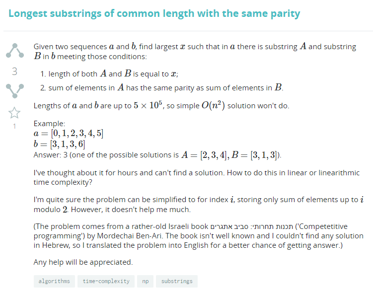
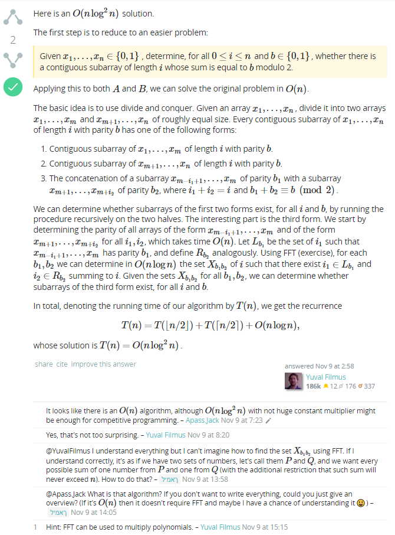
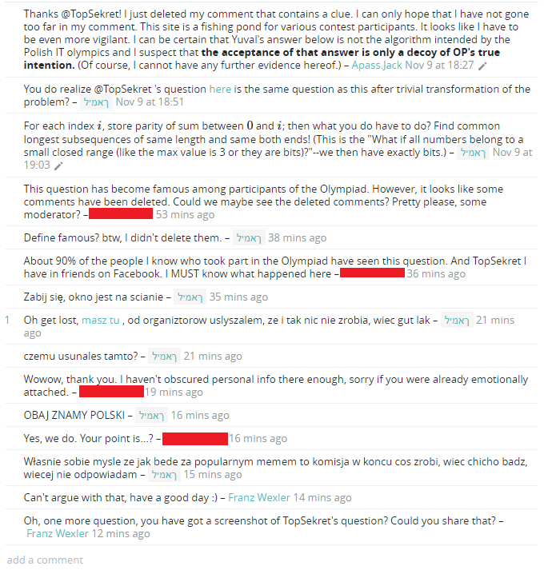
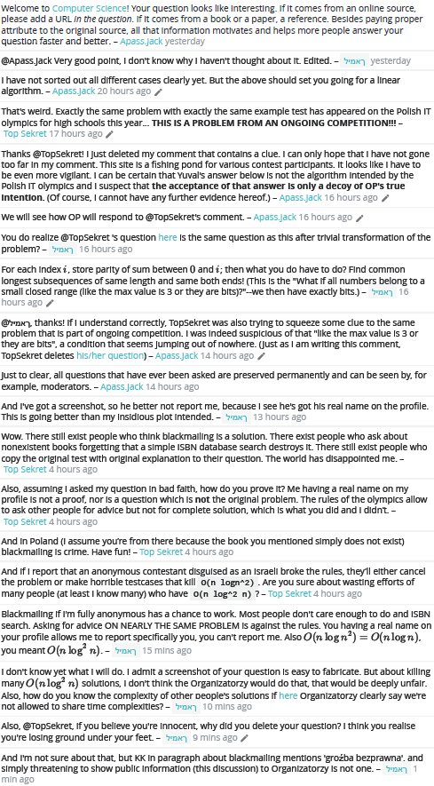
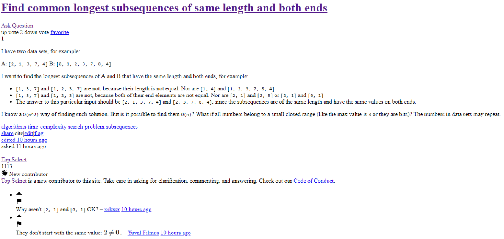
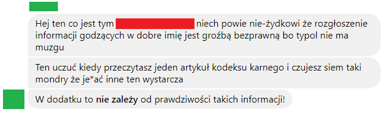
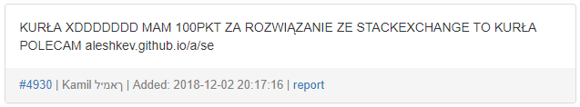
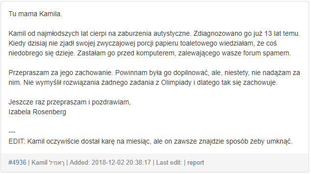
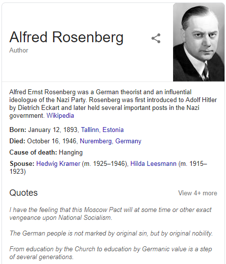

# Saga o Stack Exchange

*Zostałem poproszony o napisanie narratywy do obrazków, ale jest ona w większości zbędna, możecie spokojnie patrzeć tylko na obrazki.*

*Jeżeli ktoś czuje się urażony treścią tej strony, niech się ze mną grzecznie skontaktuje, a nie zaczyna od grożenia pozwem. Z góry dziękuję.*

Biorę sobie udział w Olimpiadzie Informatycznej. Zadania z niewyjaśnionych powodów są trudne i nie umiem wszystkich zrobić – zupełnie jakby komuś zależało na tym, żeby nie wszyscy mieli je zrobione. Naprawdę nie rozumiem, jak organizatorzy mogą robić tak oczywisty plagiat LOGII, ale zapomnieć o kluczowym elemencie.

Ponieważ chodzę sobie do Staszica (takiej szkoły w miejscowości niedaleko Legionowa, która byłaby nawet niezła gdyby nie nieuzasadniona nienawiść do LOGII), znam dużo osób, które też biorą udział w OI. Wszystkie oczywiście tęsknią za LOGIĄ i swoje smutki zabijają większą ilością zadanek.

W każdym razie, znam te osoby, które biorą udział w OI i od nich słyszę, że na Computer Science Stack Exchange jest pytanie o rozwiązanie jednego z zadań z OI. Po szybkim przeszukaniu najnowszych pytań, [rzeczywiście jest:](https://cs.stackexchange.com/questions/99778/longest-substrings-of-common-length-with-the-same-parity)

Ponieważ jestem mną, najbardziej zafascynowało mnie to, że pytanie zostało zadane przez niejakiego ךאמיל. Z [Wikipedią](https://en.wikipedia.org/wiki/Hebrew_alphabet) w dłoni (cóż, nie w dłoni, ale wiecie o co chodzi) szybko transliterowałem to do "Kamil". Co zdecydowanie nie jest zbyt często hebrajskim imieniem.

Więc dlaczego hebrajski alfabet? Moja hipoteza jest taka, że samo zaznaczenie tekstu jest wtedy trudniejsze, bo idzie od prawej do lewej. Tak samo z tytułem książki, z której niby jest to problem (nie istnieje tak BTW, ale rzekomy autor jest prawdziwym Izraelskim informatykiem).

> Kuba mnie informuje, że powinienem napisać tutaj coś o zbiegu okoliczności, bo niejaki Rufus był trollem [na forum](https://sio2.mimuw.edu.pl/c/oi26-1/forum/79/850/). Niestety, ironia została zgubiona w którejś warstwie i nie jest to zbieg okoliczności, po prostu ciekawostka.

I tutaj przechodzimy do najbardziej tajemniczej części. Przetłumaczony tytuł tej rzekomej książki to "Programowanie Kompetytywne: Wokół 
Wyzwań". O czym może już napisałem, jestem w Staszicu. I jedna z książek, którą nauczyciel geometrii poleca ma tytuł... "Wokół Obrotów". Przypadek? Czy może Kamil jest wśród matexów w Staszicu?

Wracając do pytania: patrzę, jest odpowiedź! To na CS SE nie jest zbyt częste przy takich trudnych problemach, ale jest:

Odpowiedź niczego sobie, nawet podobna do mojego rozwiązania z FFT (z tym wyjątkiem, że moje nie działało i miało większą złożoność).

Ale *bardzo* interesujące są komentarze pod pytaniem:
1. TopSekret to ktoś, kogo dobrze znam ze Staszica,
2. usunięte komentarze! tajemnica!

Postanawiam interweniować. Po prostu MUSZĘ wiedzieć co się tam stało. (Dalej zamazuję swoją nazwę użytkownika na czerwono.)

Jak widać, osiągnąłem sukces! Dostałem screenshota dyskusji, która okazuje się, że miała być wykorzystana do blackmailowania TopSekreta! 

Całość jest po prostu niesamowicie śmieszna. "Zabij się, okno jest na ścianie" jest świetną alternatywą dla wszystkiego: od mówienia "do widzenia", aż do publicznej służby zdrowia.

Dzięki cache'owi Google'a udało mi się nawet znaleźć pytanie, do którego zalinkował nasz Kamil, a zostało niestety rzeczywiście usunięte przez samego TopSekreta:

Postanowił on też bronić swojego dobrego imienia. Choć jestem w stanie uwierzyć, że ma doświadczenie z systemem karnym, są wątpliwości co do jego interpretacji samego *prawa*:

<strike>Na tym chyba kończy się nasza Saga o Stack Exchange. Moderatorzy usunęli większość komentarzy. Kamil przeszedł offline, by nigdy już nie wrócić. Poświęćmy chwilę jego pamięci. Lub nie, bo jest wrednym oszustem.</strike>

To był wspaniały koniec tej historii. Niestety, aby skomplikować mi życie, i żebym musiał aktualizować tę stronę, i bez innego wyraźnego powodu, Kamil postanowił zapostować jakieś bezsensowne komentarze na SIO2 (platformie, na której jest organizowana olimpiada):

I wiele innych, składających się z losowych zbitek "KURŁA", "XDDDD" (dowolna ilość liter D, różna kapitalizacja) oraz przezwisk.

Doszły do mnie wiadomości, że *pewna osoba,* nazwijmy ją A, napisała *pewnej innej osobie,* B (obydwie w matexie), o tych postach minutę po tym jak powstał pierwszy z nich. Dlatego istnieje przypuszczenie, że to A za tym wszystkim stoi.

Całość jest jednak bezsensowna:
1. Po co się chwalić wszystkim, że się oszukiwało?!
2. ךאמיל to dokładnie to samo co Kamil, więc nie widzę sensu podawania obu form, jednej jako imię i drugiej jako nazwisko. W polskim konkursie hebrajski alfabet jest tylko podejrzany.

Dowody za winą A:
1. Autor zna link do tej strony i chętnie się nim dzieli z całym światem. Ta strona nie jest nawet indeksowana przez wyszukiwarki internetowe. Nie udostępniłem jej nigdy Kamilowi; podzieliłem się nią tylko z matexem w Staszicu i paru osobom z kółka informatycznego w gimnazjum.
2. Zna Mikołaja Bulge (lub wybrał akurat jego z listy osób zakwalifikowanych do II etapu, co jest mało prawdopodobne).
3. W jednym z postów użył określenia "Bachujski", które, zostałem poinformowany przez Kubę Bachurskiego, jest używane tylko przez A.

Potem niespodziewanie pojawił się ten kuriozalny post:

Nie rozumiem znowu motywu Kamila, bo powątpiewam w istnienie rodzica pilnującego czy jego autystyczne dziecko je codziennie swoją porcję papieru toaletowego, a takie przeprosiny raczej nie wzruszą organizatorów do wybaczenia mu jego grzechów.

Ciekawostka: spróbujcie w domu wyszukać "Rosenberg" w Google.

